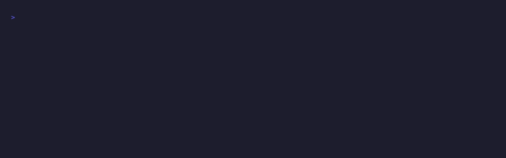

# keelson

**Your repo's architecture rules, enforced the moment an AI agent tries to break them — not 20 minutes later in CI.**

One rule file. Works at agent edit time *and* in CI. Any language.



The agent reads that denial, corrects itself, and moves on — in the same turn. You never see the bad commit.

*(Recorded against [`demo/fixture`](demo/fixture) — reproduce it with `cd demo && vhs hero.tape`.)*

---

## Why

Coding agents don't read your CONTRIBUTING.md. They take the shortest path to a working diff: a 900-line file gets another 200 lines appended, a controller reaches straight into a repository, the implementation lands without its test.

You already know this, which is why you wrote it down in `CLAUDE.md` — and why it keeps happening anyway. Prompts are suggestions. Hooks are enforcement.

CI catches it eventually, but by then the agent has moved on, the context is gone, and fixing it is your job instead of the model's.

## Install

```bash
npm install -D keelson
npx keelson init          # writes a keelson.yaml inferred from your repo
```

`init` sets the initial line limit just above your repo's 95th-percentile file, so it passes on day one and you ratchet it down. A linter that fails 400 times on install gets deleted.

Then wire up the hook in `.claude/settings.json`:

```json
{
  "hooks": {
    "PreToolUse": [
      {
        "matcher": "Write|Edit|MultiEdit",
        "hooks": [{ "type": "command", "command": "npx keelson hook", "timeout": 10 }]
      }
    ]
  }
}
```

Keep the `timeout` as a backstop. keelson bounds its own regex execution (see below), but a timeout costs nothing and is the last line if anything else goes wrong.

And the same rules in CI:

```yaml
- run: npx keelson check
```

## Rules

```yaml
version: 1

rules:
  - id: max-file-lines
    files: ["src/**/*.ts"]
    max: 300

  - id: banned-symbols
    files: ["**/*.java"]
    symbols:
      - pattern: "System\\.out\\.print"
        message: "Use SLF4J, not System.out"
      - pattern: "@Autowired\\s*$"
        message: "Use constructor injection, not field @Autowired"

  - id: layer-boundaries
    from: "**/controller/**"
    disallow: ["**/repository/**"]
    message: "Controllers must go through a service."

  - id: required-companion
    files: ["src/**/*.ts"]
    companion: "test/{name}.test.ts"
```

| Rule | Catches |
|---|---|
| `max-file-lines` | Agents appending to a file instead of splitting it |
| `banned-symbols` | `console.log`, `System.out`, field injection, debug leftovers |
| `layer-boundaries` | Dependency-direction breaches, in any language |
| `required-companion` | Implementation shipped without its test |

Every rule takes `severity: error` (blocks, exit 1) or `severity: warn` (reports only).

### `onPatternTimeout`

A regex that backtracks catastrophically is abandoned rather than allowed to hang. The hook always permits the edit and warns. What `check` does is a genuine trade-off, so it is yours to set:

```yaml
version: 1
onPatternTimeout: fail   # default; or: warn
```

| | `check` behaviour | Trade-off |
|---|---|---|
| `fail` (default) | exits 2, naming the skipped patterns | CI fails until you fix the pattern |
| `warn` | exits on violations alone, prints the same diagnostic | exactly matches the hook, but a rule can stop being enforced without failing anything |

Either way the violations reported are identical on both sides; only the exit code differs, and only when a pattern times out.

## Why not…

| | Runs at edit time | Languages | Config |
|---|---|---|---|
| **keelson** | **yes** | **any** | one file |
| ESLint / rules | no | JS/TS | per-language |
| ArchUnit | no (test time) | Java | Java code |
| dependency-cruiser | no (CI time) | JS/TS | one file |
| hand-rolled hook scripts | yes | any | per-repo bash |

The existing architecture linters are good, and they all run *after* the code exists. keelson runs the same rules at both points, so nothing passes the hook and then fails the build.

## Language support

`layer-boundaries` matches import specifiers both as resolved repo paths and as raw strings, so one rule shape covers relative imports (`../repository/x`), package names (`lodash`), and fully-qualified names (`com.acme.data.Repo`). There is no AST parser and no per-language plugin — that's the point.

Import extraction currently understands ES modules (including dynamic, multi-line and re-export forms), CommonJS, Java/Kotlin, Python and Go.

A character-level scanner decides what counts as code first, so none of these are mistaken for dependencies: line and block comments, trailing comments, Python `#` comments, template literals, Python docstrings and Kotlin/Java text blocks, and regex literals. A specifier containing `://` survives all of it, and `${ ... }` inside a template is still read as code.

## Design guarantees

- **Fails open, always.** A malformed payload, a missing config, an unreadable file, an edit it cannot reconstruct exactly, or a bug in keelson exits 0 with no decision. A tool that wedges your session when it breaks gets uninstalled. It will never block you for its own reasons — only for yours.
- **A pathological regex cannot hang your session.** Regex execution is synchronous: once a catastrophically backtracking pattern starts on the main thread, nothing can interrupt it — not a `try`/`catch`, not a timer — so failing open would be impossible. Every user pattern is therefore executed in a worker under a hard deadline, and no rule ever runs one itself. Shape heuristics are not enough here: `^(a|aa)+$` is exponential with no nested quantifier anywhere in it.
- **One slow pattern costs you only that pattern.** Each pattern is a separately interruptible job, so if one is abandoned every other rule and every other pattern still reports normally — both entry points compute the same violations either way.
- **A pattern that hits the deadline is a config bug, not a verdict about your code.** The hook always allows the edit and warns, naming the pattern — it must never block your work over a problem in the config. What CI does is your call, via `onPatternTimeout` (below). Both sides use the same deadline, and patterns are warmed before timing, so the verdict depends on the pattern rather than on how many files happened to be scanned first.
- **A pattern only ever runs against files its own rule covers.** Scoping happens before evaluation, so a slow pattern in one rule cannot affect files that rule never matched.
- **~32ms per hook invocation**, of which ~17ms is Node's own startup. Answering `required-companion` costs one `stat`, not a directory walk, so latency does not grow with repository size.
- **False positives are treated as the worst class of bug.** Blocking a legitimate edit stops your work and teaches you to uninstall the tool; missing a violation only leaves you where you started. Import detection is deliberately conservative for this reason — quoted strings, commented-out code, and Go strings outside an import block are not dependencies.
- **Same engine both sides.** `check` and `hook` run identical rule code, so the hook can't disagree with CI.
- **keelson enforces its own `keelson.yaml` on itself**, in CI and at edit time. See the repo root.

## Commands

```
keelson check [globs...]   Check the repo. Exit 1 on error-severity violations.
keelson hook               PreToolUse hook. Reads the payload on stdin.
keelson init               Write a starter keelson.yaml inferred from this repo.
```

## Status

v0.1 — four rules, working end to end. Rule ideas and bug reports welcome; see the open issues tagged `good first issue`.

## License

MIT
